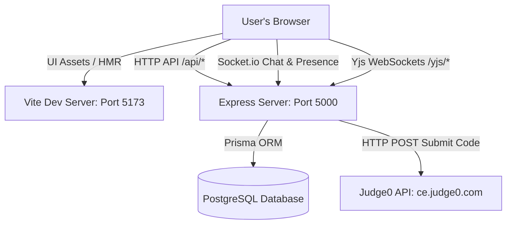

# PrepRoom Project Context

PrepRoom is a collaborative coding practice and mock interview platform that allows peers to create shared rooms, code together in a real-time synchronized editor, run code sandbox executions, and communicate via a live room chat.

---

## 1. Tech Stack

- **Frontend Client (`/frontend`):**
  - React (v19), Vite, TypeScript, React Router DOM (v7)
  - Styling: TailwindCSS (v4), Lucide Icons, Sonner (Toasts)
  - Editor Sync: `@monaco-editor/react`, `yjs`, `y-websocket` (v1.5.4 stable client), `y-monaco`
- **Backend API & Real-Time Sync Server (`/backend`):**
  - Node.js, Express, TypeScript
  - Database & ORM: PostgreSQL, Prisma ORM
  - Authentication: Custom JWT stored in secure, `HttpOnly` cookies
  - Real-Time Communication: Socket.io (Chat & Active Presence)
  - Text Sync Server: Yjs WebSockets (`y-websocket/bin/utils` sync module)
  - Rate Limiter: In-memory sliding-window middleware
- **Code Execution Sandbox:** Public Judge0 API instance (`ce.judge0.com`)

---

## 2. Architecture & Service Ports

During local development, PrepRoom operates as a split-architecture SPA + API application:



1.  **Vite Dev Server (Port `5173`):** Serves the React SPA. Any requests to `/api` are proxied to the Express backend.
2.  **Express API & Websocket Server (Port `5000`):** Combines standard REST endpoints, Socket.io channels, and Yjs text sync sockets under a single unified listener:
    -   `/api/auth`: Login, registration, and user session endpoint handlers.
    -   `/api/rooms`: Room retrieval, creation, details, and join actions.
    -   `/api/execute`: Rate-limited proxy for Judge0 compiler sandbox runs.
    -   `/socket.io`: Socket.io namespace handler managing chat relays and active user indicators.
    -   `/yjs`: WebSocket server handling collaborative document updates and cursor positions.

---

## 3. Database Schema

The schema is defined in [schema.prisma](file:///Users/divyanshuparate/Documents/PrepRoom/PrepRoom/backend/prisma/schema.prisma) and maps the following tables:

```prisma
model User {
  id            String        @id @default(cuid())
  name          String?
  email         String        @unique
  password      String
  ownedRooms    Room[]        @relation("RoomOwner")
  participants  Participant[]
  messages      Message[]
}

model Room {
  id           String        @id @default(cuid())
  title        String
  description  String?
  ownerId      String
  owner        User          @relation("RoomOwner", fields: [ownerId], references: [id], onDelete: Cascade)
  participants Participant[]
  problems     Problem[]
  messages     Message[]
  createdAt    DateTime      @default(now())
  updatedAt    DateTime      @updatedAt
}

model Participant {
  id        String   @id @default(cuid())
  userId    String
  roomId    String
  user      User     @relation(fields: [userId], references: [id], onDelete: Cascade)
  room      Room     @relation(fields: [roomId], references: [id], onDelete: Cascade)
  createdAt DateTime @default(now())

  @@unique([userId, roomId])
}

model Problem {
  id          String   @id @default(cuid())
  title       String
  description String
  difficulty  String
  roomId      String
  room        Room     @relation(fields: [roomId], references: [id], onDelete: Cascade)
  createdAt   DateTime @default(now())
  updatedAt   DateTime @updatedAt
}

model Message {
  id        String   @id @default(cuid())
  content   String
  userId    String
  roomId    String
  user      User     @relation(fields: [userId], references: [id], onDelete: Cascade)
  room      Room     @relation(fields: [roomId], references: [id], onDelete: Cascade)
  createdAt DateTime @default(now())
}
```

---

## 4. Folder Structure & Key Files

```
PrepRoom/
├── backend/                          # Express + Node + TypeScript Backend
│   ├── prisma/
│   │   └── schema.prisma             # Prisma database schema definition
│   ├── src/
│   │   ├── middleware/
│   │   │   ├── auth.ts               # JWT verification & request binding
│   │   │   └── rate-limit.ts         # In-memory sliding rate limiter
│   │   ├── routes/
│   │   │   ├── auth.ts               # Custom credentials register, login, logout
│   │   │   ├── execute.ts            # Judge0 execution runner proxy
│   │   │   └── rooms.ts              # Room creation, details, and join actions
│   │   ├── utils/
│   │   │   └── sanitize.ts           # HTML sanitization helper
│   │   └── server.ts                 # Express initialization + WebSockets (Socket.io & Yjs)
│   ├── .env                          # Backend credentials & PORT configuration
│   ├── package.json                  # Backend dependencies & script definitions
│   └── tsconfig.json                 # Backend TypeScript compiler options
├── frontend/                         # Vite + React + TS Frontend SPA
│   ├── src/
│   │   ├── assets/                   # Static media items
│   │   ├── components/
│   │   │   └── ProtectedRoute.tsx    # Route guards for authentication states
│   │   ├── context/
│   │   │   └── AuthContext.tsx       # Auth provider mapping user credentials to state
│   │   ├── pages/
│   │   │   ├── Dashboard.tsx         # User welcome, room cards grid & creation modals
│   │   │   ├── Login.tsx             # Sleek dark-mode sign-in screen
│   │   │   ├── RoomWorkspace.tsx     # Coding console, collaborative editor, chat panels
│   │   │   └── Signup.tsx            # Account registration credentials form
│   │   ├── App.css                   # Global overrides
│   │   ├── App.tsx                   # Page router mapping under AuthContext guards
│   │   ├── index.css                 # Tailwind v4 import instructions
│   │   └── main.tsx                  # React element renderer
│   ├── index.html                    # Root index container fetching Google Fonts (Inter)
│   ├── package.json                  # Frontend dependencies
│   └── vite.config.ts                # Vite config & API dev server proxy settings
├── .env                              # Root configuration variables
├── Dockerfile                        # Docker settings
├── package.json                      # Workspace command shortcuts (concurrent execution)
└── projectcontext.md                 # Project architecture and technical documentation
```

### Configuration & Running Locally
-   [package.json](file:///Users/divyanshuparate/Documents/PrepRoom/PrepRoom/package.json) at the root contains shortcuts to run both environments:
    -   `npm run install:all`: Installs package dependencies across both projects.
    -   `npm run dev`: Bootstraps the backend API/sockets server and the frontend client concurrently.
